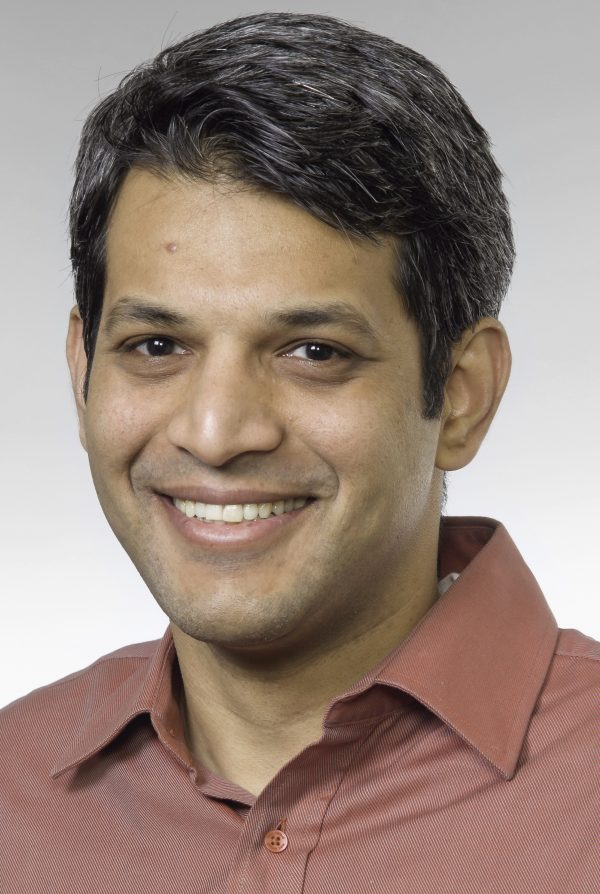

# Akshay Rajhans
[home](index.html) \| [bio](bio.html) \| [publications](publications.html) \| [talks](talks.html) \| [service](service.html) \| [etc](etc.html)

 

 Contact 

  Akshay Rajhans, Ph.D.  
  Lead Research Scientist and Head of the Advanced Research & Technology Office 
  MathWorks  
  arajhans (at) alumni (dot) cmu (dot) edu  

 

  
Biographical Sketch

 
Akshay Rajhans is the Lead Research Scientist at MathWorks where he heads the MathWorks Advanced Research & Technology Office. His team's responsibility includes research and technology innovation programs at MathWorks, including MathWorks Research Summits, MathWorks-funded research collaborations, MATLAB and Simuilink Challenge Projects program, patent program, and more. He and his team members represent MathWorks in the research community in various capacities.  

Dr. Rajhans has a Ph.D. in Electrical and Computer Engineering from Carnegie Mellon University and an M.S. in Electrical Engineering from the University of Pennsylvania. His background centers around Technical Computing and Model-Based Design, often in the application context of intelligent AI-enabled cyber-physical systems.  

Earlier in his career, Dr. Rajhans worked on development and application engineering of electronic control systems for diesel-engine applications at Cummins. As a research intern at Bosch, he co-invented a model-based approach to non-intrusive load monitoring.  

<a href="#">top</a>

 
 

<!--
  [LinkedIn](https://www.linkedin.com/in/rajhans) \| [Google Scholar](https://scholar.google.com/citations?user=522zploAAAAJ&hl=en&oi=ao) \| [IEEE Author Profile](https://ieeexplore.ieee.org/author/38232718800) \| [ACM Author Profile](https://dl.acm.org/profile/81421602783)

## Contact
Akshay Rajhans, Ph.D.  
Lead Research Scientist and Head of the Advanced Research & Technology Office 
MathWorks  
**Email**: arajhans (at) alumni (dot) cmu (dot) edu  

[LinkedIn](https://www.linkedin.com/in/rajhans) \| [Google Scholar](https://scholar.google.com/citations?user=522zploAAAAJ&hl=en&oi=ao) \| [IEEE Author Profile](https://ieeexplore.ieee.org/author/38232718800) \| [ACM Author Profile](https://dl.acm.org/profile/81421602783)
-->
