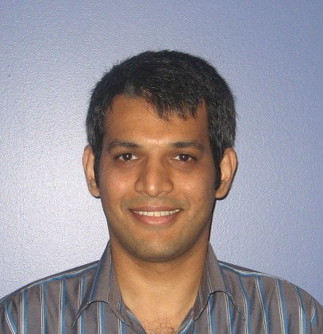

# Akshay Rajhans
[home](index.html) \| [bio](bio.html) \| [talks](talks.html) \| [panels](panels.html) \| [service](service.html) \| [publications](publications.html) \| [personal](personal.html)

## Contact
Akshay Rajhans, Ph.D.  
Senior Research Scientist  
MathWorks  

**Mail**: 3 Apple Hill Drive, Natick, MA 01760  
**Email**: Akshay (dot) Rajhans (at) mathworks (dot) com  
**Office Phone**: (508)-647-8021

[Twitter](https://twitter.com/rajhans) \| [LinkedIn](https://www.linkedin.com/in/rajhans) \| [Google Scholar](https://scholar.google.com/citations?user=522zploAAAAJ&hl=en&oi=ao)

## News
- **May 2018**
  - CPS Track Chair for Spring Simulation Multi-Conference (SpringSim) 2019
- **April 2018**
  - [HSCC 2018 Paper](/publications.html#papers) selected as a Best Repeatability Evaluation Award Finalist.
  - [Invited speaker](/talks.html#invited-talks-1) at the NSF Visioning Workshop on International Networks for Advancing CPS Research, Development, and Education Worldwide, part of CPS Week 2018.
  - [Panelist](/panels.html#panelist) on the Joint HSCC-ICCPS Panel at CPS Week 2018.
  - [Panelist](/panels.html#panelist) on the MSCIAAS Panel at SpringSim 2018.
- **March 2018** 
  - [Abstract](/publications.html#peer-reviewed-abstracts) accepted at the NSF Visioning Workshop on International Networks for Advancing CPS Research, Development, and Education Worldwide, part of CPS Week 2018.
- **February 2018**
  - Demo accepted at [HSCC 2018](https://www.hscc2018.deib.polimi.it)
- **December 2017** 
  - On the Program Committee of [NSV 2018](https://nsv-2018.github.io/nsv2018/)
  - Paper accepted at [HSCC 2018](https://www.hscc2018.deib.polimi.it)
- **November 2017** 
  - Invited talk at the [Tufts Univeristy ECE Department Colloquia Series](http://engineering.tufts.edu/ece/colloquia/), Fall 2017.
- **September 2017** 
  - Panelist at the [NIST CPS Framework Open Source Workshop](https://www.nist.gov/news-events/events/2017/09/cps-framework-open-source-workshop) 
  - Invited talk at an [MIT workshop](talks.html) on *Rethinking Modeling, Simulations and Control for the Changing Electric Energy Industry*
- **August 2017** 
  - On the [Industrial Board](http://www.iscas2018.org/industrial-board/) of [ISCAS 2018](http://www.iscas2018.org)
- **July 2017**
  - Awards Chair and a PC member for [HSCC 2018](https://www.hscc2018.deib.polimi.it), a part of [CPS Week 2018](https://cister.isep.ipp.pt/cpsweek2018/). 
  - Industry Vice Chair for [ADHS 2018](http://www.cs.ox.ac.uk/conferences/ADHS18/), a part of [CAV 2018](http://cavconference.org/2018/) and [FLoC 2018](http://www.floc2018.org). 
- **June 2017**
  - Invited speaker at [Robotica 2017](http://auvsinewengland.org/events-3/robotica-2017/robotica-2017-agenda/robotica-2017-program.html), Newton, MA.
- **May 2017**
  - Invited lecture at the [2nd IEEE Summer School on Connected and Autonomous Vehicles (ConAV)](https://www.nist.gov/news-events/events/2016/08/exploring-dimensions-trustworthiness-challenges-and-opportunities), Worcester Polytechnic Institute, Worcester, MA. 
  - Judge "[*CPS V&V Grand Prix 2017,*](http://www.cs.cmu.edu/~aplatzer/course/fcps17-competition.html)", Final Project Competition for the Spring 2017 Course [15-424/15-624/15-824 Foundations of Cyber-Physical Systems](http://www.cs.cmu.edu/~aplatzer/course/fcps17.html), Carnegie Mellon University, May 2017. **Host**: [Prof. Andre' Platzer](http://www.cs.cmu.edu/~aplatzer/). 
