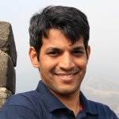

# Akshay Rajhans
[home](index.html) \| [talks](talks.html) \| [service](service.html) \| [publications](publications.html) \| [personal](personal.html)

I currently work at [MathWorks](https://www.mathworks.com) as a Senior Research Scientist focused on [cyber-physical systems](http://www.mathworks.com/discovery/cyber-physical-systems.html) (CPS). Earlier, at MathWorks, I used to be a software engineer working on core semantics of [Simulink](https://www.mathworks.com/products/simulink.html). As an intern at [Bosch Research and Technology Center](http://www.bosch.us/content/language1/html/rtc.htm) in Pittsburgh, I developed a model-based approach to non-intrusive load monitoring. At [Cummins](http://www.cumminsindia.com/), I worked on the development and application engineering of electronic control systems for diesel-engine applications. 

I have a Ph.D. in [Electrical and Computer Engineering](https://www.ece.cmu.edu/) from [Carnegie Mellon University](https://www.cmu.edu/) advised by [Prof. Bruce Krogh](https://www.ece.cmu.edu/directory/department/faculty/K/Bruce_Krogh_89.html), and an M.S. in [Electrical Engineering](https://www.ese.upenn.edu/) from the [University of Pennsylvania](https://www.ese.upenn.edu/) advised by [Prof. George Pappas](https://www.seas.upenn.edu/~pappasg). 

[Short Resume (1-page PDF)](files/docs/AkshayRajhansResume.pdf) \| [Long CV (6-page PDF)](files/docs/AkshayRajhansCV.pdf)

## Contact
Akshay Rajhans, Ph.D.  
Senior Research Scientist  
MathWorks

**Mail**: 3 Apple Hill Drive, Natick, MA 01760  
**Email**: Akshay (dot) Rajhans (at) mathworks (dot) com  
**Office Phone**: (508)-647-8021

[Twitter](https://twitter.com/rajhans) \| [LinkedIn](https://www.linkedin.com/in/rajhans) \| [Google Scholar](https://scholar.google.com/citations?user=522zploAAAAJ&hl=en&oi=ao)

## News
- **December 2017** 
  - Paper accepted at [HSCC 2018](https://www.hscc2018.deib.polimi.it).
- **November 2017** 
  - Invited talk at the [Tufts Univeristy ECE Department Colloquia Series](http://engineering.tufts.edu/ece/colloquia/), Fall 2017.
- **September 2017** 
  - Panelist at the [NIST CPS Framework Open Source Workshop](https://www.nist.gov/news-events/events/2017/09/cps-framework-open-source-workshop) 
  - Invited talk at an [MIT workshop](talks.html) on *Rethinking Modeling, Simulations and Control for the Changing Electric Energy Industry*
- **August 2017** 
  - On the Industrial Advisory Committee of [ISCAS 2018](http://www.iscas2018.org)
- **July 2017**
  - Awards Chair and a PC member for [HSCC 2018](https://www.hscc2018.deib.polimi.it), a part of [CPS Week 2018](https://cister.isep.ipp.pt/cpsweek2018/). 
  - Industry Vice Chair for [ADHS 2018](http://www.cs.ox.ac.uk/conferences/ADHS18/), a part of [CAV 2018](http://cavconference.org/2018/) and [FLoC 2018](http://www.floc2018.org). 
- **June 2017**
  - Invited speaker at [Robotica 2017](http://auvsinewengland.org/events-3/robotica-2017/robotica-2017-agenda/robotica-2017-program.html), Newton, MA.
- **May 2017**
  - Invited lecture at the [2nd IEEE Summer School on Connected and Autonomous Vehicles (ConAV)](https://www.nist.gov/news-events/events/2016/08/exploring-dimensions-trustworthiness-challenges-and-opportunities), Worcester Polytechnic Institute, Worcester, MA. 
  - Judge "[*CPS V&V Grand Prix 2017,*](http://www.cs.cmu.edu/~aplatzer/course/fcps17-competition.html)", Final Project Competition for the Spring 2017 Course [15-424/15-624/15-824 Foundations of Cyber-Physical Systems](http://www.cs.cmu.edu/~aplatzer/course/fcps17.html), Carnegie Mellon University, May 2017. **Host**: [Prof. Andre' Platzer](http://www.cs.cmu.edu/~aplatzer/). 
- **April 2017**
  - Selected on the [ACM Global Practitioner Advisory Community (ACM GPAC)](https://www.acm.org/education/gpac), consisting of 100 computing practitioners worldwide who will guide ACM in enhancing and developing practitioner-oriented resources.
  - Panelist alongside [Prof. Philip Koopman](https://users.ece.cmu.edu/~koopman/), [Prof. Raj Rajkumar](https://users.ece.cmu.edu/~raj/), and [Prof. Dan Work](https://publish.illinois.edu/dbwork/), [1st Workshop on Safe Control of Connected and Autonomous Vehicles (SCAV)](https://scav.in.tum.de/), affiliated with [Cyber-Physical Systems Week (CPS Week) 2017](https://cpsweek2017.ece.cmu.edu/).
  - Poster and Demo Chair for [Hybrid Systems: Computation and Control (HSCC) 2017](http://hscc2017.ece.illinois.edu/), part of [Cyber-Physical Systems Week (CPS Week) 2017](https://cpsweek2017.ece.cmu.edu/).
