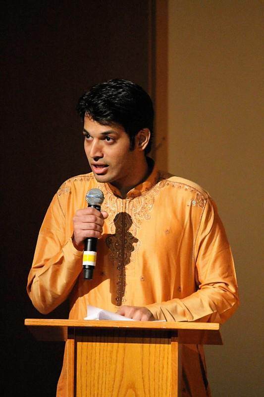

# Outside of Work
[home](index.html) \| [talks](talks.html) \| [panels](panels.html) \| [service](service.html) \| [publications](publications.html) \| [personal](personal.html)

\[Above: Master of Ceremonies at RASA: A Bharatanatyam Dance Performance and Carnatic Music, a SPICMACAY Concert, Pittsburgh, 2012.\]

- 2017-2018: Committee Member, [New England Marathi Mandal](http://www.nemm.org/index.php/aboutus/committee).
- 2012: Master of Ceremonies, [*Rasa: A Bharatanatyam Dance Performance and Carnatic Music*](http://www.andrew.cmu.edu/user/macay/events/rasa.jpg), a Society for Promotion of Indian Classical Music and Culture Amongst Youth (SPICMACAY) Concert, Pittsburgh. 
- 2009-2011: Board of Directors, [Maharashtra Mandal of Greater Pittsburgh](http://www.mmpgh.org/committee1011.shtml).
